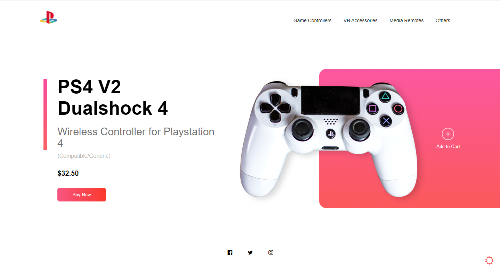
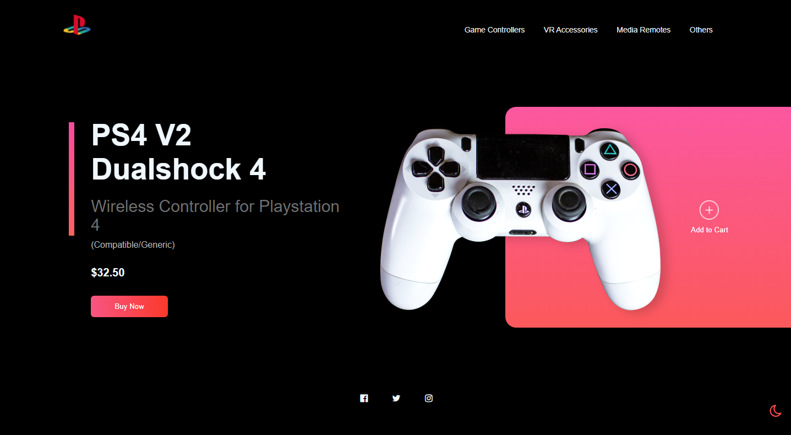
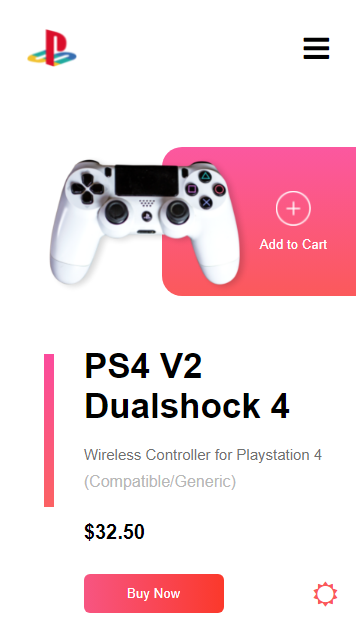
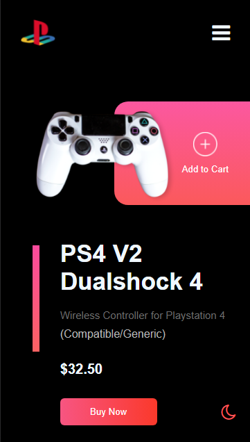
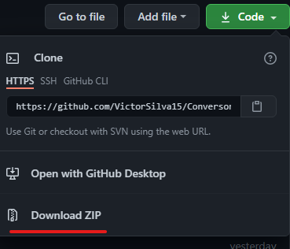

# Playstation Page Web

   

Essa página web foi produzida com auxílio do vídeo [How To Make Responsive Website Design Using HTML And CSS Step By Step](https://youtu.be/lAOkx2yZESY) do canal Easy Tutorials. No vídeo é mostrado como produzir uma página web simples e bonita com HTML e CSS. Nesse versão eu atualizei a página inserindo um botão para trocar o tema de dark para light e vice-versa. A responsividade já foi produzida pelo autor da página no vídeo de tutorial.

<h2>Status do Projeto</h2>

<h4> 🚀 Finalizado 👍 </h4>

<h2>Pré-requisitos</h2>

Para executar essa projeto basta abrir a página index.html no seu navegador (Chrome, Edge, FireFox). Se quiser modificar o código será necessário um editor de códigos de sua preferência. Recomendo usar o <a href="https://code.visualstudio.com/download" alt="VS Code">Visual Studio Code</a>.

<h2>Demonstração</h2>

- Tema Light:

- Tema Dark:

- Mobile (responsivo):

<h2>Como usar</h2>

Esse projeto não está hospedado ainda por tanto se você quiser testar em sua máquina basta baixar ele através do botão CODE em verde do lado do repositório e em seguida escolher Download ZIP que os arquivos iram para sua área de download.Após extrair a pasta do projeto para sua área de trabalho basta entrar na pasta Playstation-PageWeb e dar um duplo clique em cima do arquivo index.html que ele será aberto na seu navegador.

### 🛠 Tecnologias

As seguintes ferramentas foram usadas na construção do projeto:

- HTML

- CSS

- JavaScript

- [Font Awesome Icons](https://fontawesome.com/v4.7/icons/)

## 💪 Como contribuir para o projeto

1. Faça um **fork** do projeto.

2. Crie uma nova branch com as suas alterações: `git checkout -b my-feature`

3. Salve as alterações e crie uma mensagem de commit contando o que você fez: `git commit -m "feature: My new feature"`

4. Envie as suas alterações: `git push origin my-feature`

> Caso tenha alguma dúvida confira este [guia de como contribuir no GitHub](./CONTRIBUTING.md)

---

### Autor

<b>Victor Hugo</b>🚀

Feito com ❤️ por Victor Hugo da Silva 👋🏽 Entre em contato!

---

